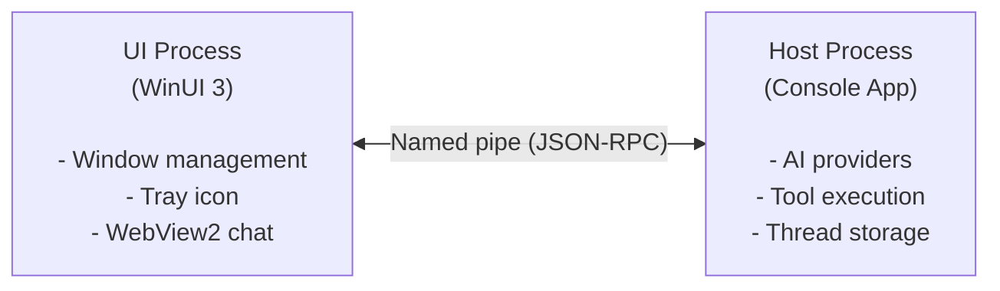

# IX Chat Architecture

IX Chat uses a dual-process architecture to separate UI concerns from AI provider communication.

## Process Model

## UI Process

The UI process is a WinUI 3 application responsible for:

- **Window Management** -- Show/hide chat window, minimize to tray
- **Tray Icon** -- System tray integration via H.NotifyIcon
- **Chat Rendering** -- WebView2 hosts an embedded HTML/CSS/JS chat interface
- **User Input** -- Captures messages and forwards to host via named pipe

The UI process has no direct dependency on AI providers or network access.

## Host Process

The host process is a console application that handles:

- **Provider Communication** -- Connects to ChatGPT or Copilot via IntelligenceX library
- **Tool Execution** -- Manages the tool registry and executes tool calls
- **Thread Storage** -- Persists conversation threads to local JSON files
- **Authentication** -- Handles OAuth flows and credential storage

## Named Pipe IPC

The two processes communicate via a named pipe:

- Pipe name: `IntelligenceX.Chat.{ProcessId}`
- Protocol: JSON-RPC 2.0 messages
- Direction: Bidirectional (request/response and notifications)

### Message Types

| Type | Direction | Purpose |
|---|---|---|
| `chat.send` | UI -> Host | Send a user message |
| `chat.response` | Host -> UI | Stream AI response chunks |
| `chat.toolCall` | Host -> UI | Notify about tool execution |
| `auth.status` | Host -> UI | Authentication state changes |
| `thread.list` | UI -> Host | Request conversation list |

## Tool Registry

Tools are registered at startup from installed tool packs:

1. Host scans for `IntelligenceX.Tools.*` assemblies
2. Each tool pack registers its tools with the tool registry
3. When the AI requests a tool call, the host executes it locally
4. Results are sent back to the AI provider for the next response

## Storage Paths

| Data | Location |
|---|---|
| Conversations | `%APPDATA%/IntelligenceX/threads/` |
| Configuration | `%APPDATA%/IntelligenceX/config.json` |
| Auth tokens | `%APPDATA%/IntelligenceX/auth/` |
| Logs | `%APPDATA%/IntelligenceX/logs/` |

## Related

- [IX Chat Overview](/docs/chat/overview/) -- Feature summary
- [Quickstart](/docs/chat/quickstart/) -- Install and run
- [Tool Packs](/docs/tools/overview/) -- Available tool packs
