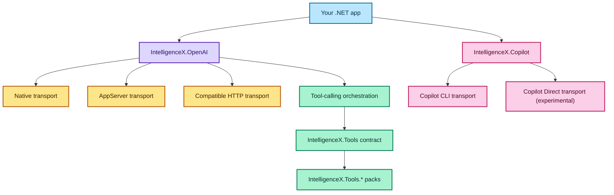

# .NET Library Overview

The core library provides a Codex app-server client, ChatGPT auth helpers, and a lightweight Copilot client.

Quickstart: [Library Quickstart](/docs/library/quickstart/)  
Providers: [Provider Setup](/docs/library/providers/)  
Tools: [Tool Calling](/docs/library/tools/)
Tool packs: [Library Tool Packs](/docs/library/tool-packs/)

## Conceptual Package Map



## Quick start (app-server)

```csharp
using IntelligenceX.OpenAI.AppServer;

var client = await AppServerClient.StartAsync(new AppServerOptions {
    ExecutablePath = "codex",
    Arguments = "app-server"
});

await client.InitializeAsync(new ClientInfo("IntelligenceX", "Demo", "0.1.0"));
var login = await client.StartChatGptLoginAsync();
Console.WriteLine($"Login URL: {login.AuthUrl}");
await client.WaitForLoginCompletionAsync(login.LoginId);

var thread = await client.StartThreadAsync("gpt-5.3-codex");
await client.StartTurnAsync(thread.Id, "Hello from IntelligenceX");
```

## Quick start (native ChatGPT)

```csharp
using IntelligenceX.OpenAI;
using IntelligenceX.OpenAI.Native;

var options = new IntelligenceXClientOptions {
    TransportKind = OpenAITransportKind.Native
};
options.NativeOptions.UserAgent = "IntelligenceX/0.1.0";
await using var client = await IntelligenceXClient.ConnectAsync(options);

await client.EnsureChatGptLoginAsync(onUrl: url => Console.WriteLine(url));
var turn = await client.ChatAsync("Summarize the latest PR");
Console.WriteLine(turn.Outputs.Count);
```

## Quick start (OpenAI-compatible HTTP)

Use this when you want a local/self-hosted model server that exposes an OpenAI-style HTTP API.

```csharp
using IntelligenceX.OpenAI;

var options = new IntelligenceXClientOptions {
    TransportKind = OpenAITransportKind.CompatibleHttp,
    DefaultModel = "llama3.1"
};
options.CompatibleHttpOptions.BaseUrl = "http://127.0.0.1:11434";
options.CompatibleHttpOptions.AllowInsecureHttp = true;

await using var client = await IntelligenceXClient.ConnectAsync(options);
var turn = await client.ChatAsync("Hello");
Console.WriteLine(EasyChatResult.FromTurn(turn).Text);
```

## Easy session (one-liner)

```csharp
using IntelligenceX.OpenAI;

var result = await Easy.ChatAsync("Hello!");
Console.WriteLine(result.Text);
```

## Streaming deltas

```csharp
using IntelligenceX.OpenAI;

var session = await EasySession.StartAsync();
using var subscription = session.SubscribeDelta(Console.Write);
await session.ChatAsync("Stream a short answer.");
```

## Usage & limits

```csharp
using IntelligenceX.OpenAI.Native;
using IntelligenceX.OpenAI.Usage;

using var usage = new ChatGptUsageService(new OpenAINativeOptions());
var report = await usage.GetReportAsync(includeEvents: true);
Console.WriteLine(report.Snapshot.PlanType);
Console.WriteLine(report.Snapshot.RateLimit?.PrimaryWindow?.UsedPercent);
```

## Sandbox policy (app-server)

```csharp
using IntelligenceX.OpenAI.AppServer;

await using var client = await AppServerClient.StartAsync();
await client.InitializeAsync(new ClientInfo("IntelligenceX", "Demo", "0.1.0"));
var thread = await client.StartThreadAsync("gpt-5.3-codex");
var sandbox = new SandboxPolicy("workspace", allowNetwork: true, writableRoots: new[] { "C:\\repo" });
await client.StartTurnAsync(thread.Id, "Run tests", sandboxPolicy: sandbox);
```

## Streaming deltas (native)

```csharp
using IntelligenceX.OpenAI;

await using var client = await IntelligenceXClient.ConnectAsync(new IntelligenceXClientOptions {
    TransportKind = OpenAITransportKind.Native
});

using var subscription = client.SubscribeDelta(text => Console.Write(text));
await client.ChatAsync("Stream a short answer.");
```

## Copilot chat client

```csharp
using IntelligenceX.Copilot;

var options = new CopilotChatClientOptions {
    Transport = CopilotTransportKind.Cli,
    DefaultModel = "gpt-5.3-codex"
};

await using var chat = await CopilotChatClient.StartAsync(options);
var answer = await chat.ChatAsync("Summarize the latest PR");
Console.WriteLine(answer);
```

```csharp
using IntelligenceX.Copilot;

var options = new CopilotChatClientOptions {
    Transport = CopilotTransportKind.Direct,
    DefaultModel = "gpt-5.3-codex"
};
options.Direct.Url = "https://example.internal/copilot/chat";
options.Direct.Token = Environment.GetEnvironmentVariable("COPILOT_DIRECT_TOKEN");

await using var chat = await CopilotChatClient.StartAsync(options);
var answer = await chat.ChatAsync("Summarize the latest PR");
Console.WriteLine(answer);
```

## Config overrides

Add `.intelligencex/config.json` (or set `INTELLIGENCEX_CONFIG_PATH`) to avoid hardcoding.

```json
{
  "openai": {
    "defaultModel": "gpt-5.3-codex",
    "instructions": "You are a helpful assistant.",
    "reasoningEffort": "medium",
    "reasoningSummary": "auto",
    "textVerbosity": "medium",
    "appServerPath": "codex",
    "appServerArgs": "app-server"
  },
  "copilot": {
    "cliPath": "copilot",
    "autoInstall": false
  }
}
```
