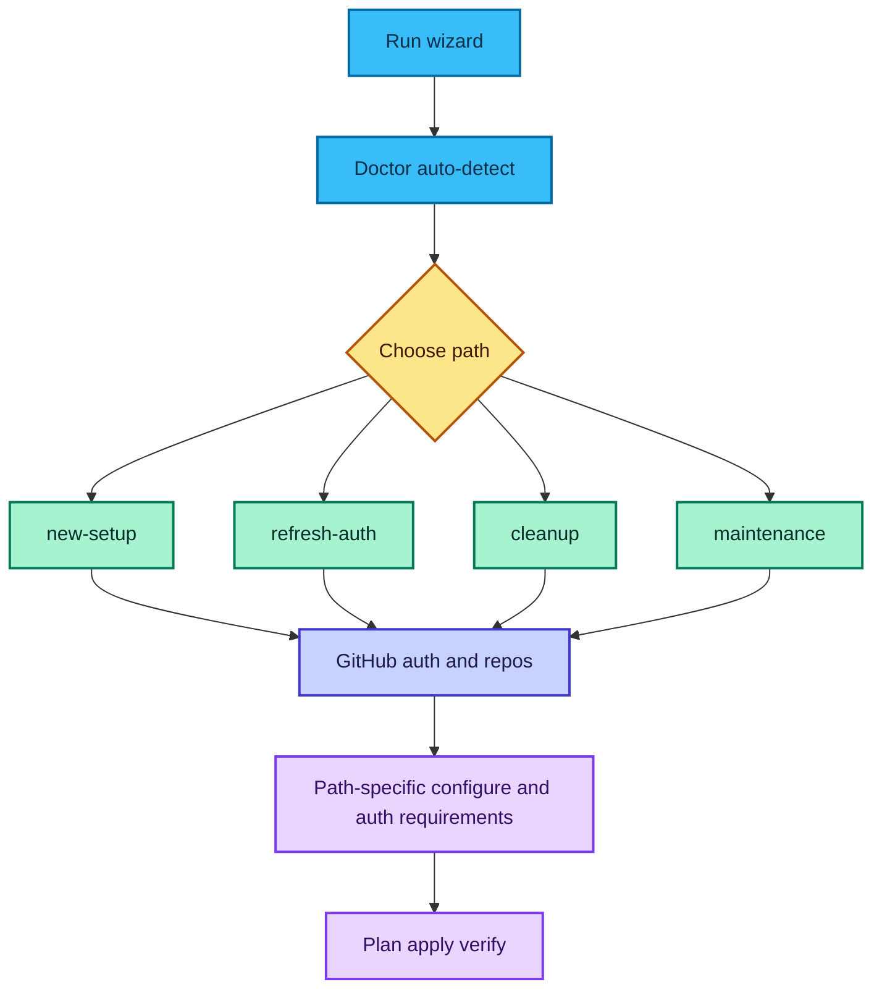

# Onboarding Wizard (CLI)

The CLI wizard is the fastest way to set up the reviewer across one or more repositories.
It runs locally, opens any needed browser approvals, and applies changes via PRs by default.
After merging onboarding, run the [First PR Checklist](/docs/reviewer/first-pr-checklist/) on your next PR.

## Screenshots

- Configure step: [Screenshot](/docs/screenshots/#cli-wizard---configure)
- Verify step: [Screenshot](/docs/screenshots/#cli-wizard---verify)

## Quick start

```powershell
intelligencex setup wizard
```

The wizard now starts with doctor-based auto-detect and path selection before GitHub auth/repo selection.
You can still run preflight manually:

```powershell
intelligencex setup autodetect --json
```



Path requirements and Bot parity flow are documented in [Web Onboarding Flow](/docs/reviewer/web-onboarding/).

## Web UI (preview)

```powershell
intelligencex setup web
```

See [Web Setup UI](/docs/reviewer/setup-web/) for limitations and security notes.

## What the wizard does

- Authenticates GitHub (device flow, PAT, or GitHub App)
- Lets you pick single or multiple repos
- Builds reviewer config via presets or custom JSON
- Preset flow exposes static-analysis controls (gate, runner strict mode, packs, export path)
- Can load existing config from a repo and preview the workflow
- Summary includes workflow status (managed/unmanaged) from the first selected repo
- Logs into ChatGPT (native transport) if secrets are needed
- Creates PRs with workflow/config updates

## Operations

- Setup / update workflow + config (default)
- Update OpenAI secret only
- Cleanup (remove workflow/config)
- Maintenance (inspect first, then pick setup/update-secret/cleanup)

Path-first non-interactive examples:

```powershell
intelligencex setup wizard --path new-setup --repo owner/name
intelligencex setup wizard --path refresh-auth --repo owner/name
intelligencex setup wizard --path cleanup --repo owner/name --dry-run
```

If auto-detect preflight fails and you need richer diagnostics:

```powershell
intelligencex setup wizard --verbose
```

## GitHub auth modes

1) GitHub App (installation token)
   - Recommended for org-wide onboarding
   - You can create an App via the manifest flow
   - The wizard can save the App profile for reuse

2) OAuth device flow
   - Fastest for a single repo

3) Personal access token
   - Use only if required by your org policy

## Config options

- Workflow only (no config)
- Presets (balanced, picky, security, performance, tests, minimal)
- Load existing config from a repo
- Custom JSON (editor, path, or paste)

For config ownership and precedence details, see [Workflow vs JSON](/docs/reviewer/workflow-vs-json/).

## Example: org-wide GitHub App flow

```text
1) Click "Create App (manifest)" in the wizard
2) Install the app in the org
3) Click "List installations"
4) Pick the org installation
5) Click "Use installation token"
```

## Example: one-repo device flow

```text
1) Run: intelligencex setup wizard
2) Pick "Device flow"
3) Authenticate and select a single repo
4) Plan + Apply (creates PR)
```

## Manual secret mode

If you do not want the CLI to upload secrets automatically:

```powershell
intelligencex setup wizard --manual-secret
```

The wizard writes the secret value to a local temporary file and prints instructions for manual paste.
For direct terminal output, add `--manual-secret-stdout` (requires `--manual-secret` and is less safe).

## Explicit secrets block

Explicit secrets mapping is enabled by default. If needed, you can force it explicitly:

```powershell
intelligencex setup wizard --explicit-secrets
```

## Troubleshooting

- If no installations are found for a GitHub App, install it first:
  https://github.com/apps/<app-id>/installations
- If the wizard cannot list repos, verify the token scope and access.
