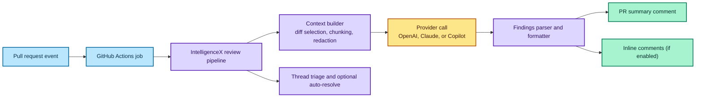

# Reviewer Overview

The reviewer runs in GitHub Actions (and Azure DevOps summary-only) and posts a structured review comment on PRs. Azure DevOps summary-only uses the PR-level changes endpoint (cumulative diff).
It can use:
- OpenAI/ChatGPT (native transport) with a ChatGPT login bundle.
- Claude (Anthropic Messages API) with an `ANTHROPIC_API_KEY`.
- Copilot (via Copilot CLI) for teams already using GitHub Copilot.
- Copilot direct HTTP transport (experimental) for custom gateways.

## Recommended onboarding
- CLI wizard: `intelligencex setup wizard`
- Local web UI (preview): `intelligencex setup web`

Related docs:
- [Onboarding Wizard](/docs/reviewer/onboarding-wizard/)
- [Web Setup UI](/docs/reviewer/setup-web/)
- [Understanding Reviewer Output](/docs/reviewer/review-output/)
- [Configuration](/docs/reviewer/configuration/)
- [Workflow vs JSON](/docs/reviewer/workflow-vs-json/)
- [Security and Trust](/docs/reviewer/security-trust/)
- [Projects + PR Monitoring](/docs/reviewer/projects-pr-monitoring/)
- [Project Bootstrap and Sync](/docs/reviewer/project-bootstrap-sync/)
- [Project Views and Operations](/docs/reviewer/project-views-and-ops/)

## Runtime Flow



## Trust model (short version)
- BYO GitHub App is supported for branded bot identity.
- Secrets are stored in GitHub Actions (you control access).
- Web UI binds to localhost only; tokens never leave your machine.

**Engine Scope**
- Review pipeline: resolve inputs, build context, assemble prompt, call provider, parse inline comments, post summary/inline output.
- Providers and transports: OpenAI (native/appserver), Claude (Anthropic Messages API), OpenAI-compatible HTTP endpoints (Ollama/OpenRouter/etc.), and Copilot (CLI/direct).
- Context builder: diff-range selection, file filtering, chunking, redaction, language hints, related PRs.
- Formatter/output: summary templates, inline comment formatting, structured findings block.
- Thread triage/auto-resolve: load threads, require evidence, summarize/append optional replies.

**Success Metrics**
- Review latency (p50/p95) from job start to posted comment.
- Failure rate for review runs (auth, preflight, provider errors).
- Reviewer usefulness score (maintainer feedback or “kept” findings rate).
- Inline quality (false-positive rate based on fixes/confirmations).

**Default Mode + Model Policy**
- Default review mode: `hybrid` (summary + inline when supported; falls back to summary-only).
- Default provider/model: OpenAI with `gpt-5.5` unless configured otherwise; Claude and Copilot are opt-in.
- Safe defaults: skip drafts; skip workflow changes unless allowed; no secrets/writes on untrusted PRs; core reviewer defaults fail-open only for transient errors, while the bundled GitHub workflow exports fail-open env defaults for provider/runtime failures so auth outages do not block CI; budget summary enabled; auto-resolve limited to bot threads with evidence; secrets audit on.

## Reusable workflow (quick start)

```yaml
jobs:
  review:
    uses: EvotecIT/IntelligenceX/.github/workflows/review-intelligencex-core.yml@<pinned-sha>
    with:
      reviewer_source: source
      openai_transport: native
      review_config_path: .intelligencex/reviewer.json
      mode: hybrid
      length: medium
    secrets:
      INTELLIGENCEX_AUTH_B64: ${{ secrets.INTELLIGENCEX_AUTH_B64 }}
      INTELLIGENCEX_GITHUB_APP_ID: ${{ secrets.INTELLIGENCEX_GITHUB_APP_ID }}
      INTELLIGENCEX_GITHUB_APP_PRIVATE_KEY: ${{ secrets.INTELLIGENCEX_GITHUB_APP_PRIVATE_KEY }}
```

The long value after `@` is a pinned workflow commit SHA. Keep it pinned for security; update it intentionally when you upgrade.

`reviewer_source: source` is best when you want the latest workflow/reviewer behavior from source.
Use `reviewer_source: release` when you prefer a packaged release artifact for tighter version control.
Use `style` (review tone/style profile) and `output_style` (rendering preset) as optional inputs when needed.

## Inputs → environment mapping (short)

The reusable workflow maps `with:` inputs to environment variables the reviewer reads.

| Workflow input | Environment variable |
| --- | --- |
| `repo` | `INPUT_REPO` |
| `pr_number` | `INPUT_PR_NUMBER` |
| `reviewer_token` | `INTELLIGENCEX_GITHUB_TOKEN` |
| `reviewer_source` | `REVIEWER_SOURCE` |
| `reviewer_release_repo` | `REVIEWER_RELEASE_REPO` |
| `reviewer_release_tag` | `REVIEWER_RELEASE_TAG` |
| `reviewer_release_asset` | `REVIEWER_RELEASE_ASSET` |
| `reviewer_release_url` | `REVIEWER_RELEASE_URL` |

## Minimal config (native OpenAI)

```json
{
  "review": {
    "provider": "openai",
    "openaiTransport": "native",
    "model": "gpt-5.5",
    "mode": "inline",
    "length": "long",
    "reviewUsageSummary": true
  }
}
```

## Minimal config (Claude)

```json
{
  "review": {
    "provider": "claude",
    "model": "claude-opus-4-1",
    "mode": "inline",
    "length": "long",
    "reviewUsageSummary": true
  }
}
```

## Quick flow (end-to-end)

```powershell
# 1) Auth login (stores tokens locally)
intelligencex auth login

# 2) Setup reviewer (creates PR)
intelligencex setup wizard
```

## What to configure next
- Model/provider + output style
- Review length and strictness
- Auto-resolve/triage behavior for bot threads
- Triage-only mode (skip full review, only triage threads)
- Usage summary line (optional)

## How to interpret the review comment

By default:
- `Todo List ✅` and `Critical Issues ⚠️` are treated as merge blockers.
- `Other Issues 🧯` are suggestions and should not block merges by default.

## Usage and credits line

Enable `reviewUsageSummary` to append limits/credits. OpenAI uses the ChatGPT account snapshot, while Claude uses the live Anthropic provider-limit snapshot. See [Configuration](/docs/reviewer/configuration/).
