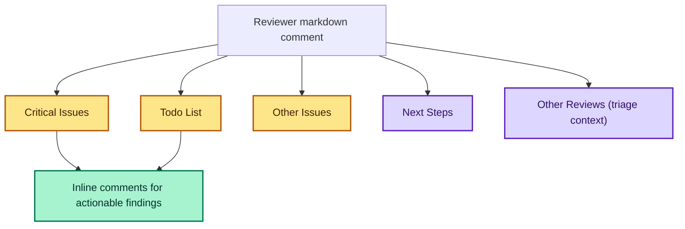

# Understanding Reviewer Output

The IntelligenceX reviewer posts a structured Markdown comment on each PR. The sections are intentionally split into merge blockers vs suggestions.

The reviewer uses H2 headings (`## ...`) for each required section to keep the output easy to scan and tooling-friendly.

## Output Contract Map

## Merge blockers vs suggestions

Merge blockers:
- `Todo List ✅`
- `Critical Issues ⚠️`

Suggestions:
- `Other Issues 🧯`

`Next Steps 🚀` is optional guidance and should not be treated as a merge gate by default.

## Inline comments

Inline comments are used to point at exact locations in the diff.

Rules of thumb:
- If a merge blocker has a specific location, expect an inline comment for it.
- Style-only nits should not block merges unless they affect correctness, security, or reliability.

In this repo, “reliability” includes maintainability concerns that can realistically cause defects over time (for example unclear ownership, error handling gaps, brittle parsing, or drift-prone duplicated logic).

## Other reviews

You may also see additional automated review comments (for example “Claude Code Review”).

These should be treated as advisory by default, but any item labeled as a correctness/security/reliability issue should be triaged and fixed unless maintainers explicitly choose to accept the risk.

If reviewer thread context is enabled, the reviewer may add:
- `Other Reviews 🧩`

This section is triage-oriented. Items may be labeled as stale, resolved, actionable, or noise.
