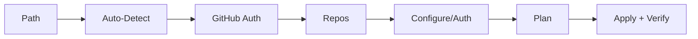

# Setup Web UI (Preview)

Run the local setup UI:

```powershell
intelligencex setup web
```

This starts a local web server and opens the wizard in your browser (http://127.0.0.1 only).

## Screenshots

- Configure step: [Screenshot](/docs/screenshots/#web-ui---configure)
- Verify step: [Screenshot](/docs/screenshots/#web-ui---verify)

## Quick flow

```text
1) Start the web UI
2) Choose onboarding path (new setup / fix auth / cleanup / maintenance)
3) Run auto-detect preflight
4) Authenticate with GitHub (device flow or app install)
5) Select repos
6) Plan + Apply
```



Path requirements (GitHub/repo/AI auth) and Bot contract checks are defined in [Web Onboarding Flow](/docs/reviewer/web-onboarding/).

Operations available:
- Setup / update workflow + config
- Update OpenAI secret only (requires auth bundle)
- Cleanup (remove workflow/config)
- Maintenance (inspect and choose operation)
- Optional GitHub App manifest flow (create app + installation token)
- Load existing config from a repo (manage existing setup)
- Load workflow preview for the managed workflow
- Save/load config presets in the browser
- Export/import presets as JSON files
- Import prompts before overwriting existing presets

Advanced options:
- Provider toggle (openai | copilot)
- Static analysis controls when generating preset config (`analysisEnabled`, `analysisGateEnabled`, `analysisRunStrict`, packs, export path)
- OpenAI account routing supports primary-only setup (rotation/failover can be configured without `account ids`)
- Auth bundle input for secret updates (INTELLIGENCEX_AUTH_B64)

## GitHub App flow (optional)

If you want to avoid personal access tokens, you can use the GitHub App manifest flow:

1. Enter App name + App owner (org login).
2. Click “Create App (manifest)”. A browser window opens to create the app.
3. Install the app in the org/user and return to the wizard.
4. Click “List installations”, select the installation, then click “Use installation token”.
5. The GitHub token field is populated with the installation token; proceed to load repos.

## Current limitations

- OpenAI login runs locally in the web UI ("Sign in with ChatGPT") and returns an auth bundle (`authB64`) you can upload as `INTELLIGENCEX_AUTH_B64`.
- Update-secret in the web UI requires an auth bundle (either from the login button or pasted via `authB64`/`authB64Path`).
- The UI supports multi-repo setup (plan/apply), repo inspection, and setup recommendations.
- GitHub App installation tokens can only list repos the app is installed on.
- Buttons are disabled until required inputs are provided (token, repo selection, auth bundle).
- Inline hints describe what is missing before plan/apply can run.
- Status badges show auth, repo selection, and auth bundle readiness.

## Tips

- Use the "Load workflow preview" button before applying changes.
- If you want zero secret handling in the UI, enable "Skip OpenAI secret" and paste secrets manually in GitHub.
- Start with auto-detect to get a recommended path before selecting repositories.
- If you automate setup with Bot tools, verify `contractVersion` + `contractFingerprint` match before apply.

## Security notes

- The server listens on 127.0.0.1 only over HTTP (no HTTPS binding).
- GitHub tokens are sent to the local CLI server and never leave your machine.
- Use this on trusted machines only.
