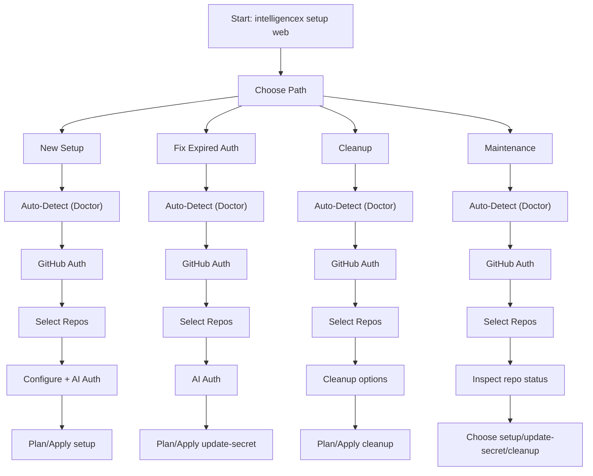

# Web Onboarding Flow

This flow runs locally and never uploads tokens to a backend.

## Overview

The web onboarding flow is path-first:

1. Choose path (`new-setup`, `refresh-auth`, `cleanup`, `maintenance`)
2. Run auto-detect preflight (doctor-backed)
3. Authenticate with GitHub
4. Select repositories
5. Configure/apply based on selected path

## Flow Diagram



## Steps

1. Start the local wizard:

```powershell
intelligencex setup web
```

2. Choose onboarding path and run auto-detect.
3. Authenticate with GitHub (device flow, token, or GitHub App).
4. Select repositories.
5. Configure operation and provider-specific auth.
6. Plan changes and review summary.
7. Apply changes (PRs are created by default).

## Status

This page tracks onboarding UX direction and expected flow. It is safe to publish as documentation-in-progress.
