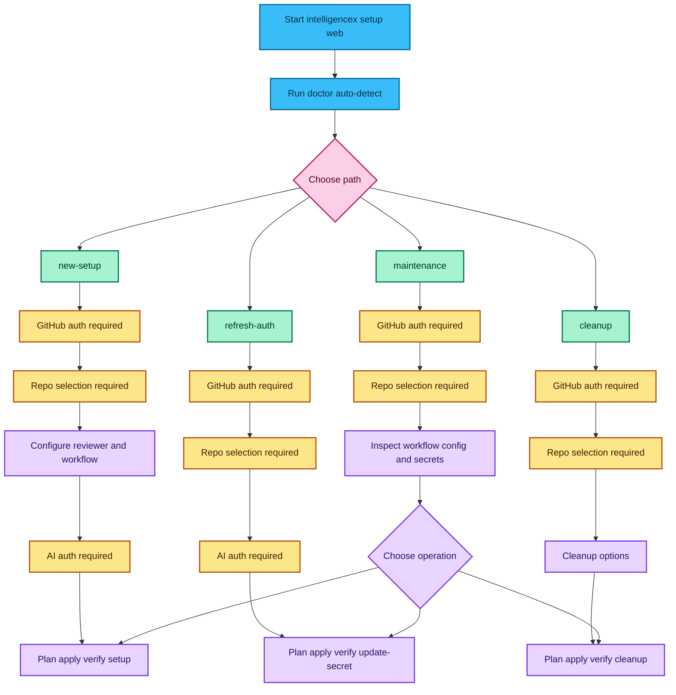
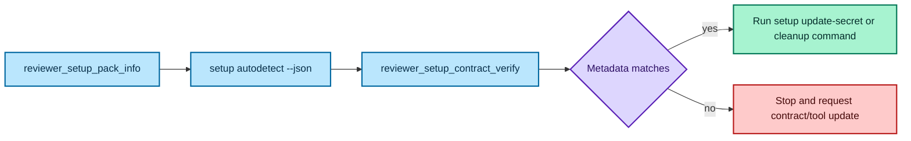

# Web Onboarding Flow

This flow runs locally and never uploads tokens to a backend.

## Canonical Path Contract

CLI, Web, and Bot all use the same path contract in `SetupOnboardingContract`.

| Path ID | Default Operation | GitHub Auth | Repo Selection | AI Auth | Typical Apply Command |
|---|---|---|---|---|---|
| `new-setup` | `setup` | Required | Required | Required | `intelligencex setup --repo owner/name --with-config` |
| `refresh-auth` | `update-secret` | Required | Required | Required | `intelligencex setup --repo owner/name --update-secret --auth-b64 <base64>` |
| `cleanup` | `cleanup` | Required | Required | Optional | `intelligencex setup --repo owner/name --cleanup` |
| `maintenance` | `setup` | Required | Required | Optional | `intelligencex setup web` |

## Path Flow Diagram

## Bot Contract-Check Flow

`.Chat` + `.Tools` should validate contract metadata before mutating setup:

## Steps

1. Start web UI: `intelligencex setup web`
2. Run auto-detect first and review suggested path.
3. Confirm path requirements shown in step 1.
4. Authenticate with GitHub and select repositories.
5. Plan, then apply.

## Notes

- Auto-detect response includes `contractVersion`, `contractFingerprint`, paths, and command templates.
- Web step-1 path hints are derived from contract metadata to reduce CLI/Web drift.
