# IX Tools

IX Tools are tool packs used by IntelligenceX hosts (especially IX Chat) to expose local capabilities to AI models.

## Production Safety Notice

- Tool packs can expose sensitive read/write operations, command execution, and environment access.
- Do not enable broad tool access directly against production assets without strict policy gates, approval controls, and audit requirements.
- Start in isolated dev/staging environments with least-privilege identities and narrow allowlists.

## Source Model

IntelligenceX.Chat classifies packs with a runtime `sourceKind`:

| Source kind | Meaning |
|---|---|
| `builtin` | Pack is part of the standard bootstrap path. |
| `open_source` | Pack is loaded from external open-source plugin assemblies. |
| `closed_source` | Pack exists but may come from private/internal assemblies not present in OSS checkouts. |

Closed-source licensing boundary:
- Closed-source packs may be available in IX Chat private/licensed environments.
- Using those packs in external/custom hosts requires a separate license.

## Tool Pack Loading Flow

```mermaid
flowchart LR
  classDef host fill:#BAE6FD,stroke:#0369A1,color:#082F49,stroke-width:2px;
  classDef pack fill:#DDD6FE,stroke:#5B21B6,color:#2E1065,stroke-width:2px;
  classDef runtime fill:#A7F3D0,stroke:#047857,color:#052E2B,stroke-width:2px;

  A["IX Chat host startup"] --> B["ToolPackBootstrap"]
  B --> C["Discover assemblies"]
  C --> D["Register descriptors and tools"]
  D --> E["Normalize sourceKind and tier"]
  E --> F["Expose tool registry to model runtime"]
  F --> G["Tool call -> local execution -> result"]

  class A,B host;
  class C,D,E pack;
  class F,G runtime;
```



## Pack Inventory (Current Runtime Truth)

The table below reflects the actual bootstrap in `IntelligenceX.Chat.Tooling/ToolPackBootstrap.cs`.

| Pack | Descriptor ID | Source kind | Default in IX Chat | Tier | Platform |
|---|---|---|---|---|---|
| Event Log (EventViewerX) | `eventlog` | `builtin` | Yes | SensitiveRead | Windows |
| File System | `fs` | `builtin` | Yes | ReadOnly | Cross-platform |
| Reviewer Setup | `reviewersetup` | `builtin` | Yes | ReadOnly | Cross-platform |
| Email (Mailozaurr) | `email` | `builtin` | Yes (OSS pack; runtime dependency-gated) | SensitiveRead | Cross-platform |
| Office Documents (OfficeIMO) | `officeimo` | `open_source` | Yes (OSS pack; runtime dependency-gated) | ReadOnly | Cross-platform |
| PowerShell Runtime | `powershell` | `builtin` | No (OSS pack; opt-in by policy) | DangerousWrite | Windows/PowerShell hosts |
| ComputerX | `system` | `closed_source` | Yes (when available) | ReadOnly | Windows |
| ADPlayground | `ad` | `closed_source` | Yes (when available) | SensitiveRead | Windows (domain environments) |
| TestimoX | `testimox` | `closed_source` | Yes (when available) | SensitiveRead | Windows |

`Tier` is a pack-summary signal, not a per-tool mutability contract.
Individual tools remain the source of truth for read vs governed-write behavior through their routing, execution, and write-governance metadata.
Mixed-mode governed-write examples in the current runtime include `eventlog_channel_policy_set` / `eventlog_classic_log_ensure` / `eventlog_classic_log_remove` in `eventlog`, `system_service_lifecycle` / `system_scheduled_task_lifecycle` in `system`, and `ad_user_lifecycle` / `ad_computer_lifecycle` in `active_directory`.

## IX Chat vs .NET Integration

### IX Chat

- Tool packs are loaded by the host bootstrap.
- Some packs are always available in OSS (`eventlog`, `fs`, `reviewersetup`).
- Some are optional/conditional for runtime reasons (`email` dependency gating, `powershell` safety opt-in), while still being OSS-oriented packs.
- Some are enabled by default but may not exist in OSS environments (`system`, `ad`, `testimox`).
- Mixed-mode packs are normal: IX Chat can expose mostly-read packs that still contain governed-write tools when runtime policy allows them.
- Closed-source packs are intended for IX Chat private/licensed usage by default.

### .NET library (custom apps)

You can build your own tool registry and register specific packs in code:

```csharp
var tools = new ToolRegistry();
tools.Register<FileSystemToolPack>();
tools.Register<EmailToolPack>();

var result = await Easy.ChatAsync("Summarize changed files", tools: tools);
```

For package-based integration, use only packs you actually reference.
For closed-source packs, assume unavailable unless you have a separate license for external-host use.

## Related

- [Tool Catalog](/docs/tools/catalog/) - Pack-by-pack summary and representative tools
- [Tool Pack Governance](/docs/tools/governance/) - Naming, provenance, and delivery rules
- [IX Chat Architecture](/docs/chat/architecture/) - How packs are loaded by the host
- [Tool Calling](/docs/library/tools/) - Using tool calling in the .NET library
