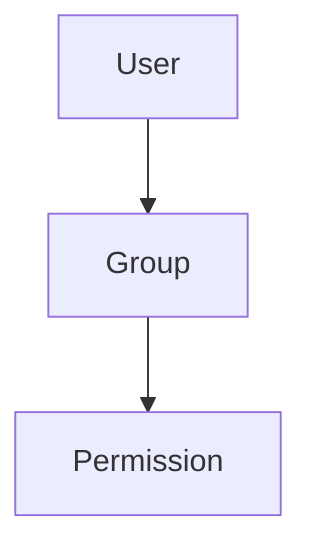

# Tool Output Contract (UI-Facing)

Tools return a **string payload** back to the model. When the payload is JSON, the UI can extract a stable subset of fields to render tool traces consistently (tables, code, markdown).

This contract is **additive**: tools may include only a few fields (for example `summary_markdown`) and still be considered compliant.

## Goals

- Keep tools as thin wrappers over engines (ComputerX, ADPlayground/TestimoX, EventViewerX, etc.).
- Keep tool outputs machine-readable (JSON first) and UI-friendly (small markdown summaries + render hints).
- Allow the assistant to request visualizations (including Mermaid) without inventing per-tool bespoke output formats.

## Envelope (Top-Level Fields)

When tools return JSON, the root should be an object with some of these fields:

- `ok` (boolean): tool succeeded.
- `error_code` (string, optional): stable error identifier (for example `not_found`, `access_denied`, `invalid_argument`).
- `error` (string, optional): human-readable error message.
- `hints` (array of string, optional): remediation hints for users/operators.
- `is_transient` (boolean, optional): whether retry may succeed.
- `summary_markdown` (string, optional but recommended): short, human-readable summary intended for UI display.
- `meta` (object, optional): machine-readable metadata (counts, truncation, paging, preview sizes, etc.).
- `render` (object or array, optional): UI render hints (table/code/markdown/mermaid).

Notes:

- The UI must tolerate missing fields and unknown fields.
- If the payload is not JSON (or not an object), the UI should treat the payload as plain text.

## `summary_markdown`

`summary_markdown` should be valid CommonMark and is the primary tool output shown in a collapsible tool block.

Recommended patterns:

- Headings: `### Title`
- Small tables (preview only)
- Fenced code blocks

Mermaid is supported via fenced blocks:

````markdown
### Relationship graph (preview)


````

The assistant can also generate Mermaid diagrams from tool outputs (for example, visualize AD group membership) even if the tool itself does not emit Mermaid.

## `meta`

`meta` is a stable machine-readable object that helps the UI display counts, truncation, and other operational details.

Common keys:

- `count` (int): number of items returned in the primary list.
- `truncated` (bool): whether results were truncated by caps.
- `scanned` (int, optional): number of items scanned/considered.
- `preview_count` (int, optional): number of rows included in `summary_markdown` preview tables.

Tools may add additional fields (for example paging cursors) without breaking clients.

## `render`

`render` provides UI hints so the GUI can render tables/code natively (instead of parsing markdown).

Current shape:

- `render` may be a single object (one block), or an array of blocks (future expansion).
- The UI must ignore unknown kinds.

### Table render hint

```json
{
  "kind": "table",
  "rows_path": "events",
  "columns": [
    { "key": "time_created_utc", "label": "Time (UTC)", "type": "datetime" },
    { "key": "id", "label": "ID", "type": "int" }
  ]
}
```

Semantics:

- `rows_path` points to a JSON array on the tool output root (for example `"events"` or `"top_event_ids"`).
- Each row is expected to be an object.
- `columns[].key` maps to row properties.
- `columns[].type` is a display hint (examples: `string`, `int`, `bool`, `bytes`, `datetime`, `path`).

### Code render hint

```json
{
  "kind": "code",
  "language": "text",
  "content_path": "text"
}
```

Semantics:

- `content_path` points to a string field on the tool output root.
- `language` is a display hint. Use `"mermaid"` when the content is a Mermaid diagram.

## Engine-First Visualization Workflow

For heavy or domain-specific logic:

1. Tools call engines and return typed/structured JSON (plus `summary_markdown` previews).
2. The assistant decides whether to visualize:
   - Show a table (use `render.kind="table"`).
   - Emit Mermaid in assistant markdown (or tool `summary_markdown`) when the user requests a diagram.
3. The WinUI renderer (`OfficeIMO.MarkdownRenderer`) renders markdown, including Mermaid fenced blocks.
