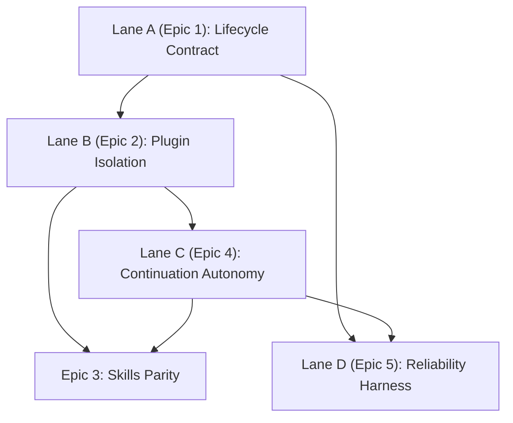

# Chat/Tools OpenClaw Parity Parallel Workboard (2026-03-05)

Status: Active  
Tracking: repo-local only (`InternalDocs/backlogs/*`, `TODO.md`)  
GitHub issues: not used for this stream

## Lane Graph

## Active Lanes

## Lane A - Lifecycle Contract
- [x] Add explicit `accepted` and `context_ready` status emission with compatibility aliases.
- [x] Add terminal `done|error|timeout` status emission before terminal frames.
- [x] Add queue/lane wait heartbeat updates with elapsed and queue position.
- [x] Add deterministic status-order tests for default and timeout flows.

## Lane B - Plugin Isolation
- [x] Remove hardcoded built-in assembly allowlist from bootstrap path.
- [x] Move pack-specific runtime option contract to pack-keyed config bag.
- [x] Extend architecture guardrail coverage to host/tooling plugin neutrality paths.
- [x] Add synthetic pack integration test proving no Chat code edits for new pack discovery.

## Lane C - Continuation Autonomy
- [x] Gate compact follow-up classification behind structured continuation context.
- [x] Add tests for short fresh-intent negative classification including non-Latin input.
- [x] Tighten single-token carryover replay eligibility without structural anchors.
- [x] Make continuation marker parsing tolerant to wrappers while remaining fail-closed.

## Lane D - Reliability Harness
- [x] Add queue contention and cancellation progression scenario tests.
- [x] Add startup bootstrap lag fault-injection tests with latency budget assertions.
- [x] Add deterministic host-target fallback ranking soak coverage.

## Lane E - Skills Parity
- [x] Add structured `ix:skills:v1` runtime snapshot derived from routing family/action diagnostics.
- [x] Thread skills snapshot through working-memory continuation augmentation/persistence.
- [x] Add autonomous continuation-loop tests that assert multi-step execution guided by skills snapshot.

## Current Patch Set (Started)

1. `ResolveFollowUpTurnClassification` now requires structured continuation context for lexical compact follow-up classification.
2. Routing path now uses `continuationContractDetected || HasFreshPendingActionsContext(threadId) || continuationExpandedFromContext` as the structural gate.
3. Added regression tests for compact short fresh intents without structure and structured-context compact follow-up behavior.
4. Added lifecycle terminal status tokens and request-flow emission:
   - `accepted`
   - `context_ready`
   - `done`
   - `error`
   - `timeout`
5. Added timeout-specific error classification path (`chat_timeout`) instead of generic `chat_failed` for turn-timeout cancellations.
6. Built-in tool assembly default discovery now comes from runtime `IntelligenceX.Tools.*.dll` scanning (no hardcoded static allowlist in bootstrap path), with updated metadata tests.
7. Added plugin synthetic-pack integration coverage proving plugin discovery flows into registry/catalog contracts without Chat runtime code edits.
8. Introduced pack-keyed runtime option bag flow and shared option-bag application for built-in/plugin pack constructors, with plugin-id override coverage.
9. Extended architecture guardrail coverage to host/tooling plugin-neutrality paths (host manifest-coupling guardrails + tooling built-in assembly allowlist guardrail).
10. Tightened carryover replay gating so single-token compact follow-ups require structural continuation anchors, with regression coverage for anchored vs unanchored behavior.
11. Made continuation marker parsing wrapper-tolerant (quote/fence/list wrappers) while preserving fail-closed behavior for non-wrapper preface content.
12. Added request-flow lifecycle status-order tests covering default success and timeout terminal ordering (`accepted -> context_ready -> done|timeout`) with terminal-frame ordering assertions.
13. Added session queue/global lane wait heartbeat progression tests validating repeated wait statuses with queue-position + elapsed messaging and global-lane elapsed heartbeat visibility.
14. Added queue contention + cancellation progression request-flow scenarios covering active-turn cancellation progression and queued-turn cancellation while preserving downstream queue advancement.
15. Added startup bootstrap lag fault-injection tests with explicit wait/priming latency budget assertions.
16. Added deterministic host-target fallback ranking soak coverage for known-host and scenario-distinct fallback paths.
17. Added structured runtime/hello skills snapshot signaling (`ix:skills:v1`) with deterministic family-action skill inventory coverage.
18. Persisted and replayed skills snapshot in working-memory checkpoints so restart follow-ups keep capability skill context.
19. Added end-to-end autonomous continuation-loop coverage validating compact follow-up skill snapshot carryover plus tool-round progression.
20. Added deterministic five-round autonomous continuation soak coverage to verify no user re-prompt is required during extended tool-round execution.
21. Added plugin-isolation end-to-end coverage proving empty-registry chat turns omit model tool schemas and complete without tool lifecycle/status activity.
22. Added per-turn plugin pack hot-toggle coverage proving `EnabledPackIds` changes tool schema exposure between turns without cross-turn leakage.
23. Added dropped-response autonomous recovery coverage proving duplicate replay tool-calls are deduplicated while the loop continues to completion without user re-prompt.
24. Added protocol-level isolation assertion coverage proving empty-registry turns emit no tool-related status frames across routing/execution/recovery tool status families.
25. Added cross-thread plugin isolation coverage proving per-thread `EnabledPackIds` pack selection does not leak tool schema exposure or executed tool identity across concurrent session threads.
26. Added extended mixed-failure autonomy soak coverage (drop + replay anomalies) proving six-round continuation completes without user re-prompt or tool-round-limit termination.
27. Added mid-loop tool-exception autonomy coverage proving `PlanExecuteReviewLoop` continues remaining rounds and reaches completion with stable `tool_exception` attribution.
