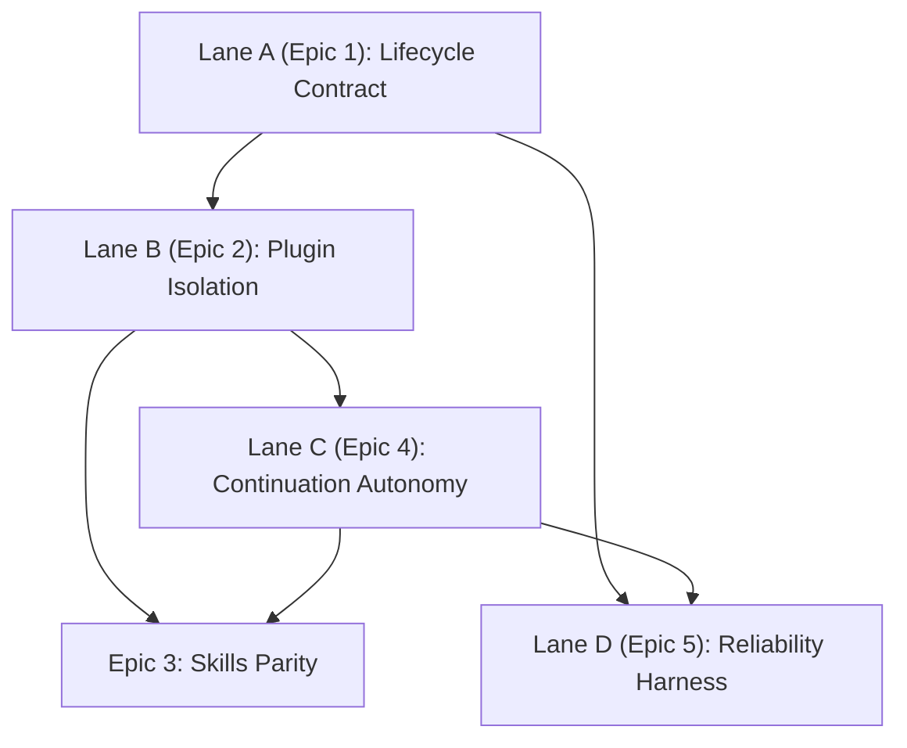

# Chat/Tools OpenClaw Parity Parallel Workboard (2026-03-05)

Status: Active  
Tracking: repo-local only (`InternalDocs/backlogs/*`, `TODO.md`)  
GitHub issues: not used for this stream

## Lane Graph

## Active Lanes

## Lane A - Lifecycle Contract
- [x] Add explicit `accepted` and `context_ready` status emission with compatibility aliases.
- [x] Add terminal `done|error|timeout` status emission before terminal frames.
- [ ] Add queue/lane wait heartbeat updates with elapsed and queue position.
- [ ] Add deterministic status-order tests for default and timeout flows.

## Lane B - Plugin Isolation
- [x] Remove hardcoded built-in assembly allowlist from bootstrap path.
- [x] Move pack-specific runtime option contract to pack-keyed config bag.
- [x] Extend architecture guardrail coverage to host/tooling plugin neutrality paths.
- [x] Add synthetic pack integration test proving no Chat code edits for new pack discovery.

## Lane C - Continuation Autonomy
- [x] Gate compact follow-up classification behind structured continuation context.
- [x] Add tests for short fresh-intent negative classification including non-Latin input.
- [ ] Tighten single-token carryover replay eligibility without structural anchors.
- [ ] Make continuation marker parsing tolerant to wrappers while remaining fail-closed.

## Lane D - Reliability Harness
- [ ] Add queue contention and cancellation progression scenario tests.
- [ ] Add startup bootstrap lag fault-injection tests with latency budget assertions.
- [ ] Add deterministic host-target fallback ranking soak coverage.

## Current Patch Set (Started)

1. `ResolveFollowUpTurnClassification` now requires structured continuation context for lexical compact follow-up classification.
2. Routing path now uses `continuationContractDetected || HasFreshPendingActionsContext(threadId) || continuationExpandedFromContext` as the structural gate.
3. Added regression tests for compact short fresh intents without structure and structured-context compact follow-up behavior.
4. Added lifecycle terminal status tokens and request-flow emission:
   - `accepted`
   - `context_ready`
   - `done`
   - `error`
   - `timeout`
5. Added timeout-specific error classification path (`chat_timeout`) instead of generic `chat_failed` for turn-timeout cancellations.
6. Built-in tool assembly default discovery now comes from runtime `IntelligenceX.Tools.*.dll` scanning (no hardcoded static allowlist in bootstrap path), with updated metadata tests.
7. Added plugin synthetic-pack integration coverage proving plugin discovery flows into registry/catalog contracts without Chat runtime code edits.
8. Introduced pack-keyed runtime option bag flow and shared option-bag application for built-in/plugin pack constructors, with plugin-id override coverage.
9. Extended architecture guardrail coverage to host/tooling plugin-neutrality paths (host manifest-coupling guardrails + tooling built-in assembly allowlist guardrail).
