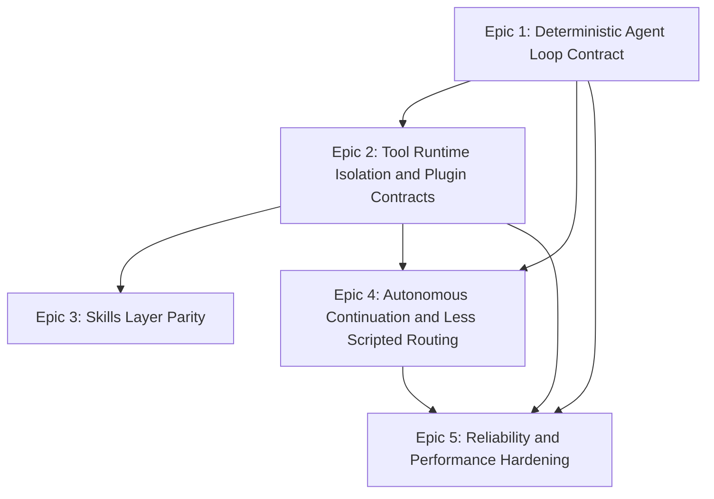

# IntelligenceX Chat/Tools OpenClaw Parity Roadmap

Status: Proposed  
Date: March 5, 2026  
Reference OpenClaw snapshot: `c522154771efa94c0524b856475f77e45ca04672`

## Goal

Build a less scripted, more autonomous, faster, and more reliable Chat runtime where Tools are plugin-like capabilities instead of permanently coupled runtime assumptions.

## Success Criteria

1. Chat can run with zero tools and remain stable, transparent, and useful.
2. Tool capabilities are contract-discovered and loadable/unloadable without Chat code edits.
3. Continuation behavior is structure-first and resilient under long turns.
4. Per-session execution remains deterministic under concurrency and retries.
5. Regression suites prevent lexical/scripted routing drift.

## Epic 1: Deterministic Agent Loop Contract

Scope:
1. Standardize turn lifecycle phases across service and host: `accepted`, `queued`, `lane_wait`, `context_ready`, `model_plan`, `tool_execute`, `review`, `done`, `error`, `timeout`.
2. Add explicit wait/terminal semantics for run completion in chat RPC contract.
3. Add phase heartbeats for long model phases with elapsed and retry counters.

Deliverables:
1. Chat service lifecycle contract DTO + docs.
2. Host/service status harmonization and event emission tests.
3. Structured `wait` endpoint behavior spec and tests.

Acceptance:
1. Lifecycle sequence is deterministic in tests for normal, timeout, cancellation, and tool-failure paths.
2. No silent terminal states without `done|error|timeout`.
3. Long turns emit periodic heartbeat statuses.

## Epic 2: Tool Runtime Isolation and Plugin Contracts

Scope:
1. Make plugin-only mode a first-class deployment profile with explicit diagnostics and health checks.
2. Enforce manifest-first plugin contracts (`ix-plugin.json`) and remove any hidden fallback loading assumptions.
3. Add plugin capability snapshotting so Chat consumes capability contracts, not pack-specific behavior.

Deliverables:
1. Plugin-only profile presets for host/service.
2. Startup capability snapshot artifact (enabled packs, families, actions, health).
3. Contract test suite for manifest validation, loading, duplicates, disablement, and no-pack startup.

Acceptance:
1. New plugin pack can be integrated without editing Chat routing code.
2. Plugin-only + zero-pack startup remains healthy and non-fatal.
3. Capability snapshot is reused on continuation turns.

## Epic 3: Skills Layer Parity

Scope:
1. Introduce explicit skill locations and precedence model:
   workspace skills -> user skills -> bundled skills.
2. Add skill gating contracts (required binaries, env, config flags) with deterministic load diagnostics.
3. Support plugin-provided skill directories.

Deliverables:
1. `skills` loading config with precedence and conflict resolution.
2. Skill eligibility evaluator and diagnostics surface.
3. Regression tests for multilingual skill prompts and gated skill behavior.

Acceptance:
1. Skill enablement/disablement is explainable from diagnostics only.
2. Conflicting skill names resolve predictably by precedence.
3. Plugin skills are loaded and gated identically to core skills.

## Epic 4: Autonomous Continuation and Less Scripted Routing

Scope:
1. Remove remaining lexical/scripted continuation gates and replace with structural markers plus turn-shape signals.
2. Improve continuation carryover to preserve intent and multi-host scope safely.
3. Keep weighted routing conservative on compact acknowledgements while avoiding over-trim on operational prompts.

Deliverables:
1. Updated continuation classifier and replay guard contracts.
2. Expanded non-English and punctuation-diverse continuation tests.
3. Domain-affinity and evidence reuse hardening under partial metadata.

Acceptance:
1. Compact continuation turns remain autonomous without repetitive user confirmation loops.
2. Guardrails still block unsafe scope shifts.
3. No regressions in existing language-neutral routing tests.

## Epic 5: Reliability and Performance Hardening

Scope:
1. Add SLO-oriented test harness for queue latency, phase duration, and tool timeout behavior.
2. Add bounded fallback waits in startup-sensitive paths to avoid latency spikes.
3. Add deterministic host-target fallback ranking tests (recency + specificity).

Deliverables:
1. Baseline performance profile for chat turn phases and tool execution.
2. Fault-injection tests for bootstrap lag, plugin load failures, and tool transport errors.
3. Reliability dashboard metrics emitted from host/service.

Acceptance:
1. P95 queue wait and phase durations are measurable and tracked.
2. Startup priming delays do not violate hello/status latency budgets.
3. Host fallback behavior remains deterministic across runs.

## Execution Order (Recommended)

1. Epic 1 first (stabilizes runtime contract and observability).
2. Epic 2 second (hard boundary for tool/plugin isolation).
3. Epic 4 third (autonomy improvements on top of stable contract).
4. Epic 3 fourth (skills parity once plugin boundaries are stable).
5. Epic 5 continuously and as release gate.

## Dependency Graph

## Parallel Execution Model (No GitHub Issues)

Tracking policy:
1. Use only repo-local tracking in `InternalDocs/backlogs/` and `TODO.md`.
2. Do not create GitHub issues for this roadmap.
3. Work progresses in parallel lanes with explicit dependency gates.
4. Active execution board: `InternalDocs/backlogs/chat-tools-openclaw-parallel-workboard-2026-03-05.md`.

Parallel lanes:
1. Lane A (Epic 1): status contract + terminal semantics + wait heartbeat.
2. Lane B (Epic 2): plugin isolation + manifest/capability contract enforcement.
3. Lane C (Epic 4): continuation structure-first behavior and carryover safety.
4. Lane D (Epic 5): benchmark/fault-injection harness running continuously.

Gate rules:
1. Lane B cannot close until Lane A status lifecycle tokens are stable.
2. Lane C can run in parallel with Lane A but must not regress language-neutral tests.
3. Lane D runs continuously and blocks release only on agreed SLO budget failures.
4. Lane C and Lane B outcomes feed Epic 3 skill precedence and gating.

## 60-Day Delivery Plan

1. Week 1-2: Epic 1 contract + lifecycle test matrix.
2. Week 3-4: Epic 2 plugin isolation profile + capability snapshot.
3. Week 5-6: Epic 4 continuation/routing hardening + multilingual regressions.
4. Week 7-8: Epic 3 skills precedence/gating + plugin skills.
5. All weeks: Epic 5 perf/reliability instrumentation and budget checks.

## Release Gates

1. `IntelligenceX.Chat.Tests` green with new lifecycle/continuation/guardrail suites.
2. `IntelligenceX.Tools.Tests` green with plugin/manifest/contract suite updates.
3. Plugin-only smoke runs pass for:
   host startup, service startup, chat request without tools, and dynamic plugin enablement.
4. No hardcoded pack-routing regressions against architecture guardrails.
