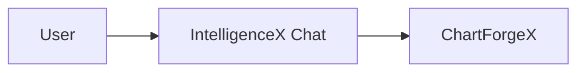

# ChartForgeX Native Visuals Agent Brief

This is the handoff brief for an agent working in `C:\Support\GitHub\ChartForgeX`. The goal is to make ChartForgeX better as a reusable visual engine for native applications, including IntelligenceX Chat, without making an IntelligenceX-specific renderer.

## Mission

Add reusable ChartForgeX capabilities so native .NET applications can render and export rich visual artifacts without embedding HTML as the application shell.

The first consumer is IntelligenceX Chat, but the implementation must be product-neutral and useful for other hosts: desktop apps, reports, documentation generators, monitoring tools, package dashboards, and OfficeIMO export flows.

## Hard Boundaries

Follow `C:\Support\GitHub\ChartForgeX\AGENTS.md`:

- Keep `ChartForgeX` core dependency-free.
- Keep static rendering deterministic and script-free by default.
- Keep host-specific behavior in adapter packages.
- Keep topology product-neutral.
- Do not add IntelligenceX, Active Directory, provider auth, chat, or tool-routing concepts to ChartForgeX.
- Preserve SVG and PNG parity for visual polish.
- Preserve target framework support expected by the repo.

## Current Useful Surface

ChartForgeX already has strong building blocks:

- `ChartForgeX.Topology` for product-neutral network/topology/service maps.
- `TopologyLayoutMode.ForceDirected`, `Layered`, `DenseGrouped`, `Geographic`, and related layout helpers.
- `TopologyRenderOptions`, `TopologyView`, scenarios, legends, icons, and metadata attributes.
- SVG and PNG topology renderers.
- `VisualBlocks` and `VisualGrid` for metric cards, dashboards, strips, timelines, micro-visuals, and report-like cards.
- `VisualCanvas` for layered fixed-size composition.
- `ImageComposition` and dependency-free raster decode/encode/write paths.
- `ChartForgeX.Markup` for Markdown-friendly `chartforgex topology` fence extraction, topology markup parsing, diagnostics, and topology emission.
- `ChartForgeX.Interactivity.Html` as an HTML adapter package, not the core rendering model.

Use and extend those patterns instead of inventing an app-only layer.

## Deliverables

### 0. Markdown Visual Block Pipeline

Generalize the current Markdown/markup path before adding app-specific adapters.

Current state:

- `ChartForgeXMarkdown` extracts fenced `chartforgex topology`, `chartforgex-topology`, `cfx topology`, and `cfx-topology` blocks.
- `MarkupTopologyParser` parses raw topology markup or Markdown containing the first topology fence.
- The current surface is topology-first, not a general visual artifact scanner.

Needed state:

- a product-neutral scanner that can extract all supported ChartForgeX visual fences from Markdown
- a parser API that accepts already-scanned visual blocks from OfficeIMO or another Markdown AST owner
- one-based source line and fence info preserved for diagnostics
- parser dispatch by visual kind
- diagnostics for unsupported fence names and unsupported Mermaid syntax
- no dependency on a Markdown rendering engine in ChartForgeX core
- no HTML generation requirement for parsing

Minimum fence names:

- `chartforgex topology`
- `cfx topology`
- `chartforgex flow`
- `cfx flow`
- `mermaid`
- `chartforgex table` / `cfx table` after the table artifact lands

Suggested shape:

```csharp
public sealed class VisualMarkupBlock {
    public string FenceName { get; init; }
    public string Payload { get; init; }
    public int StartLine { get; init; }
    public IReadOnlyDictionary<string, string> Attributes { get; init; }
}

public sealed class VisualMarkupParseResult {
    public IReadOnlyList<VisualArtifact> Artifacts { get; init; }
    public IReadOnlyList<MarkupDiagnostic> Diagnostics { get; init; }
}
```

Names can change. The important point is that hosts can give ChartForgeX a Markdown string and receive typed visual artifacts plus diagnostics, not HTML fragments.

Also provide the same artifact creation path for hosts that already parsed Markdown through OfficeIMO:

```csharp
public VisualMarkupParseResult ParseBlocks(IEnumerable<VisualMarkupBlock> blocks);
```

That keeps `ChartForgeX.Markup` useful as a standalone scanner while avoiding a second Markdown parser inside IntelligenceX native transcript rendering.

### 1. Product-Neutral Visual Artifact Contract

Add a reusable descriptor model in core or a suitable shared project, for example:

```csharp
public sealed class VisualArtifact {
    public string Id { get; init; }
    public VisualArtifactKind Kind { get; init; }
    public string? Title { get; init; }
    public string? Subtitle { get; init; }
    public object Model { get; init; }
    public VisualArtifactExportCapabilities Exports { get; init; }
    public IReadOnlyDictionary<string, string> Metadata { get; init; }
}
```

Names can change, but the contract must be:

- product-neutral
- serializable where practical
- renderable to SVG/PNG where supported
- inspectable by native hosts
- export-friendly for OfficeIMO and other document/report producers
- not tied to WinUI, WPF, HTML, or IntelligenceX

### 2. Native Host Metadata

Expose renderer output metadata so native apps do not parse HTML/SVG strings:

- natural size
- content bounds
- title/subtitle
- legend items
- selectable regions
- hit-test ids
- status/severity metadata
- export formats available
- fallback rendering path

This can start as static metadata and later grow into interaction contracts.

### 3. Flow Diagram Support

Implement a reusable flow diagram path for common Mermaid-style flowcharts.

Minimum useful subset:

- `graph TD`, `graph LR`, `flowchart TD`, `flowchart LR`
- node declarations
- directed edges
- edge labels
- basic node labels
- deterministic layout
- SVG and PNG output

Preferred routing:

- parse Mermaid-like flow syntax into a product-neutral ChartForgeX flow/topology model through the shared markup dispatcher
- reuse topology/visual block layout/rendering primitives where possible
- expose validation diagnostics for unsupported syntax

Do not try to implement all Mermaid syntax in the first pass.

This parser should support Markdown fences directly:

````markdown

````

It should also support native ChartForgeX flow markup:

````markdown
```chartforgex flow
layout LR
node user "User"
node app "Native app"
user -> app "asks"
```
````

### 4. Data Table Artifact

Add or formalize a reusable visual table artifact model, separate from app HTML tables and separate from any one UI toolkit.

It should support:

- columns with ids, labels, types, alignment, width hints
- rows with values and optional severity/status
- compact summary metadata
- copy/export hints and supported export formats
- native-host metadata for interaction, selection, and virtualization
- SVG/PNG static rendering for report/chat transcript previews
- OfficeIMO-friendly export handoff

This is not a request to reimplement DataTables in ChartForgeX core. ChartForgeX should own the reusable table descriptor and the rendering/export metadata. Host adapters should own the interactive control.

Proposed product-neutral model surface:

```csharp
public sealed class TableArtifact {
    public IReadOnlyList<TableColumn> Columns { get; init; }
    public ITableRowSource Rows { get; init; }
    public TableInteractionCapabilities Capabilities { get; init; }
    public TableExportCapabilities Exports { get; init; }
    public TableViewState? InitialView { get; init; }
    public VisualArtifactMetadata Metadata { get; init; }
}
```

The exact names can change, but the contract should preserve:

- column id, display label, data type, formatter key, alignment, width hint, visibility, and sort/filter support
- row id, cell values, optional severity/status, optional detail payload, and optional source span
- global search capability
- per-column filter capability
- single-column and multi-column sort capability
- row, cell, and range selection capability
- paging or virtualization hints for large row sets
- copy capability for cell, row, selected rows, visible rows, and all rows
- export capability for CSV, XLSX, DOCX, Markdown, SVG, and PNG where applicable
- command ids that a host can route without knowing IntelligenceX concepts

Interactive table behavior belongs in host/adapters:

- `ChartForgeX.WinUI` may expose a reusable `TableArtifactControl` after the core contract is stable.
- IntelligenceX may initially implement its own native table workspace against the same artifact contract.
- HTML/DataTables can remain only as an optional web adapter, not as the source of truth.

For large datasets, prefer a row-source abstraction over forcing every host to load all rows into a visual tree. The static SVG/PNG preview should render a bounded preview plus summary metadata, while the interactive native host can request pages/windows of rows for search, sort, filter, and export.

If an existing VisualBlocks table/micro-visual model already owns most of this, extend that instead of creating a parallel table engine.

### 5. Timeline Artifact

Add a reusable timeline/activity artifact model for evidence and tool execution:

- timestamp
- label
- detail
- severity/status
- source
- duration
- optional child events

It should render to compact SVG/PNG and expose enough metadata for a native host to show selection/details.

### 6. Native Adapter Strategy

Do not put WinUI dependencies in ChartForgeX core.

Evaluate a separate package such as:

- `ChartForgeX.WinUI`
- `ChartForgeX.Native.WinUI`

The adapter can target Windows-specific TFMs and expose controls/helpers such as:

- `ChartForgeXImageControl`
- `VisualArtifactControl`
- `TopologyControl`
- `FlowDiagramControl`

The first version may wrap SVG/PNG output in native image surfaces if that is the fastest reliable route. The important contract is that native applications consume typed artifacts, not HTML strings.

### 7. Example And Proof

Add a small reusable example that is not IntelligenceX-branded:

- table artifact
- flow diagram artifact
- topology artifact
- metric strip or timeline artifact
- export to SVG and PNG

If a WinUI adapter is added, include a tiny sample or smoke path proving it can display artifacts without WebView.

## What Not To Build

- No IntelligenceX-specific controls.
- No chat transcript renderer inside ChartForgeX.
- No provider/runtime/auth concepts.
- No AD-specific diagram builder.
- No HTML-only answer.
- No package dependency added to ChartForgeX core just to make native hosting easier.
- No app shell or dashboard product UI.

## Suggested Implementation Order

1. Inventory existing `VisualBlocks`, `VisualGrid`, `Topology`, `Markup`, and raster/export APIs.
2. Generalize `ChartForgeX.Markup` from topology-only Markdown extraction to visual-block scanning and parser dispatch.
3. Pick the smallest product-neutral descriptor shape for `VisualArtifact`.
4. Add renderer metadata for existing chart/topology/visual-block outputs.
5. Add the reusable table artifact or formalize the existing one.
6. Add the Mermaid-style flow subset parser and renderer through the shared markup dispatcher.
7. Add timeline artifact if it is not already covered by existing blocks.
8. Add adapter package only after the core descriptor is stable enough.
9. Add examples and smoke tests.

## Validation

Run the repo quality loop appropriate to the change:

```powershell
dotnet test .\ChartForgeX.sln -c Release
```

For visible rendering changes, also run the generated gallery path and inspect artifacts before updating baselines:

```powershell
.\Build.ps1 -Configuration Release -UpdateVisualBaseline
```

For focused topology/visual proof, include smoke tests covering SVG and PNG output and inspect generated artifacts, not only unit assertions.

## Acceptance Criteria

The work is acceptable when:

- a non-IntelligenceX sample can create at least three visual artifacts and render them
- Markdown with supported ChartForgeX and Mermaid fences parses into typed artifacts with line-aware diagnostics
- the same artifact can be exported to SVG/PNG without HTML
- the native host path does not require parsing HTML
- table artifacts declare interaction capabilities for search, sort, filter, selection, copy, export, and virtualization without depending on DataTables
- the core remains dependency-free
- SVG/PNG parity is preserved for new visuals
- unsupported Mermaid syntax fails with clear diagnostics
- tests cover current contracts rather than proving deleted or app-specific behavior
