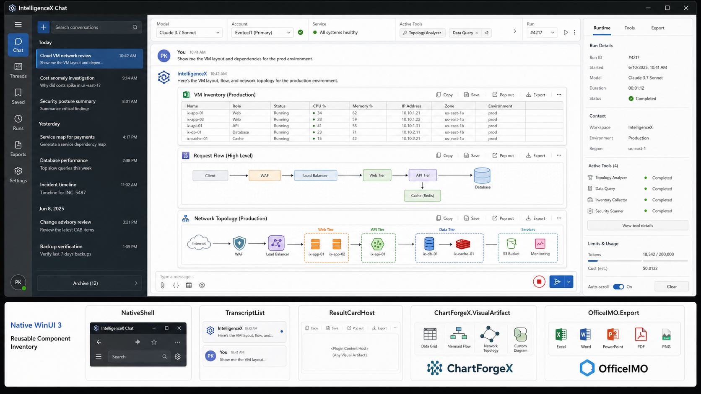
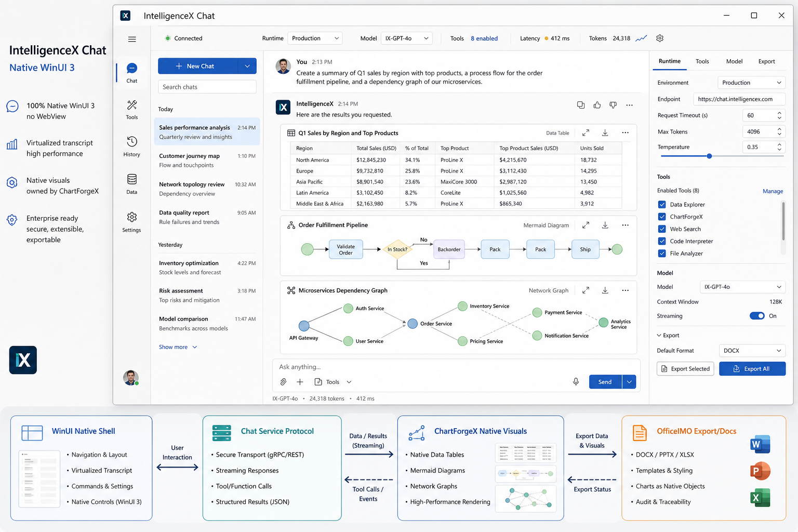
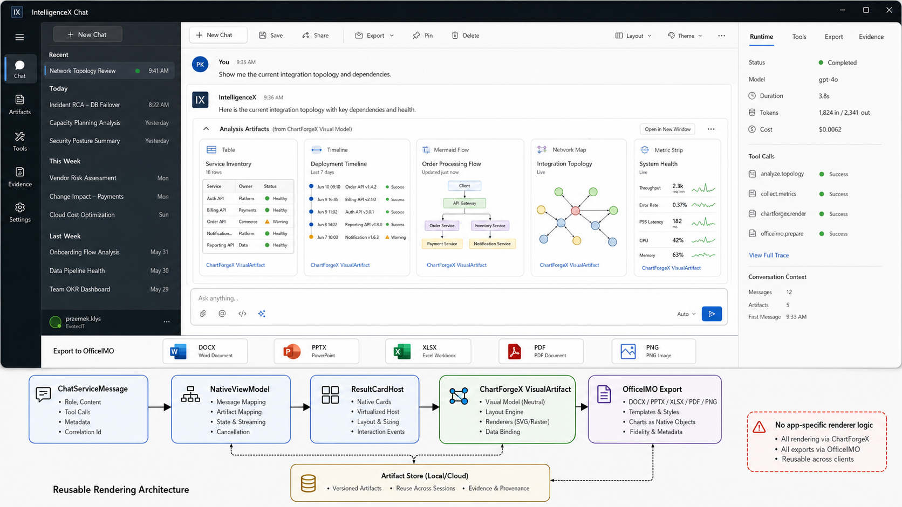

# Native Chat Product Plan

This is the working product direction for the WinUI 3 chat rebuild. It is internal planning material, not website content.

## Visual Direction

The operator console is the default daily-use target. The broader direction board and artifact-heavy variant remain useful references for later workspace work.

The shell should feel like an operational desktop application: compact navigation, readable transcript, predictable keyboard behavior, visible runtime state, native commands, and no decorative landing-page treatment.

## Ownership

- IntelligenceX owns the native shell, conversation and project experience, runtime/profile settings, result-card chrome, command routing, persistence, and packaging.
- OfficeIMO owns Markdown parsing/projection and Office document export. IntelligenceX consumes its semantic blocks instead of adding another Markdown parser.
- ChartForgeX owns product-neutral table, flow, topology, timeline, chart, SVG, PNG, and interaction metadata. IntelligenceX may provide WinUI host controls, but it must not fork those engines.
- The service/client protocol remains the reusable runtime boundary. The WinUI surface stays a thin consumer of the same state, requests, tool policy, authentication, and export behavior used by other hosts.

## Current Native Baseline

PR #1339 makes the native WinUI 3 shell the normal application path and retains the legacy WebView host only as a compatibility fallback. The native path now includes:

- persisted conversation history with native deletion
- safe recovery, manual dispatch, and clearing of queued turns
- streaming transcript and cancellation
- native Markdown projection for prose, code, tables, images, and visual fences
- interactive table preview/workspace behavior
- ChartForgeX-backed visual previews with zoom/pan in the expanded workspace and collapsible inline cards
- app/window icons, authentication status, export, and shared profile/runtime state
- shutdown settlement for initialization, sign-in, active turns, settings reload, and runtime readiness

This is a credible baseline, not the finished chat product. The current Settings button still opens the compatibility settings window, and the header does not yet offer direct model/reasoning selection.

## Product Slices

### 1. Native Runtime And Model Inspector

- [ ] Replace the compatibility settings window with native Runtime, Model, Tools, Export, Evidence, and Advanced pages.
- [ ] Add provider/model selection from the live catalog, including a clear service-default choice.
- [ ] Add reasoning effort and supported model capabilities without guessing unsupported options.
- [ ] Show the effective provider, model, reasoning, authentication, tool-pack count, and policy for the active conversation.
- [ ] Persist changes through the shared profile/conversation state owners and apply them once to the service runtime.

### 2. Projects And Conversation Management

- [ ] Add a product-neutral project/workspace schema with name, allowed roots, profile, environment, pinned context, and conversation membership.
- [ ] Group and filter conversations by project without duplicating conversation storage.
- [ ] Add rename, archive, pin, and bulk cleanup after the shared persistence contract is defined.
- [ ] Add a project switcher and an empty state that explains the active scope before the first turn.
- [ ] Keep tool access and allowed roots explicit when a project changes.

### 3. Artifact Workspace

- [ ] Give every artifact card a consistent command bar: collapse, expand, pop out, copy, save, and export where supported.
- [ ] Persist collapsed/dismissed state per conversation where that improves navigation.
- [ ] Add a right-side Evidence/Artifacts inspector with turn and source links.
- [ ] Preserve source Markdown and diagnostics when a visual cannot be rendered.
- [ ] Add screenshot and accessibility proof for tables, images, flow diagrams, and narrow layouts.

### 4. Shared Rendering Upgrades

- [ ] Finish and release ChartForgeX PR #111 before relying on its Mermaid layout, content-fit sizing, and label cleanup in package mode.
- [ ] Add reusable ChartForgeX interaction metadata for hit testing, selection, fit bounds, and native-host commands.
- [ ] Prove readable flow/topology previews at inline chat widths, not only in exported full-size images.
- [ ] Move to the OfficeIMO 3.x package line only after the Markdown, renderer, Word.Markdown, and Excel packages expose a compatible published contract.
- [ ] Revalidate native render, Markdown export, DOCX, XLSX, SVG, and PNG from the packaged artifacts after each shared-owner release.

## Release State

As of 19 July 2026, the public OfficeIMO Markdown/render/export packages used by this app remain on 2.0.1 while this branch validates the intended 2.0.2 APIs from local source. OfficeIMO's 3.0 work has begun landing, but that does not by itself make the full native Markdown/export package set consumable as 3.x.

ChartForgeX 1.0.2 is public. The Mermaid layout and sizing improvements in ChartForgeX PR #111 are still open and therefore are not part of that public package. IntelligenceX must not add a second layout engine to bridge that release gap.

## Proof Gates

- [ ] Package-mode Windows build against published OfficeIMO and ChartForgeX versions.
- [ ] Native app test suite and shared service/client tests.
- [ ] Packaged application launch with no sibling source checkout.
- [ ] Real signed-in conversation covering Markdown, table, image, visual, queued turn, export, and cancellation.
- [ ] Screenshot review at desktop and narrow widths, including dark mode and high DPI.
- [ ] Keyboard and screen-reader pass for navigation, composer, dialogs, tables, and artifact commands.
- [ ] Independent exact-head review followed by green required CI and resolved review threads.
