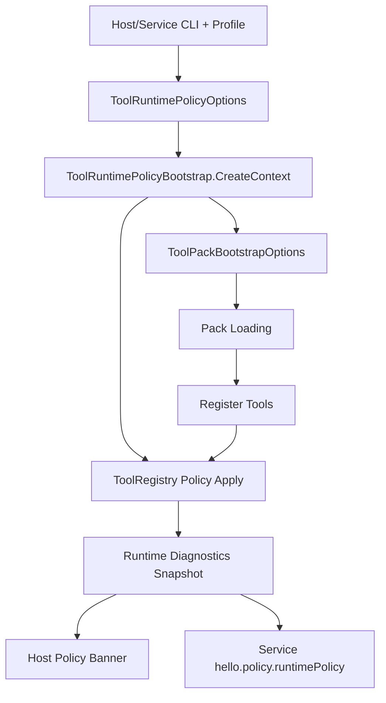
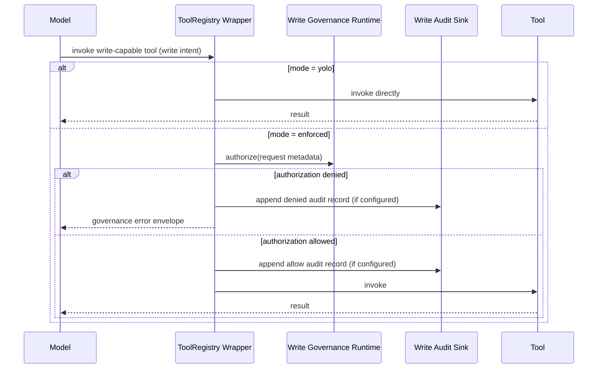

# Safe Write Tooling: Enforced vs Yolo

## Why this matters
Write-capable tools are useful, but they are also where most operational risk concentrates: accidental mutation, weak traceability, and inconsistent auth handling.

This runtime model formalizes two explicit governance modes:

- `enforced`: write intent goes through governance + audit policy.
- `yolo`: write governance checks are bypassed (for local/lab-only scenarios).

The key design goal is not just stricter behavior. It is centralized behavior:

- one bootstrap path for Host and Service
- one runtime policy snapshot for diagnostics
- one place to evolve auth/write defaults over time

## Runtime architecture


## Write request flow


## Auth preset model
Auth runtime presets shape pack-level auth behavior consistently:

- `default`: balanced defaults, probe store available, no forced probe for SMTP send.
- `strict`: probe-gated SMTP send by default (`email_smtp_probe` then `email_smtp_send`).
- `lab`: relaxed for local experimentation.

`--require-auth-runtime` raises strictness regardless of preset by enabling strict probe requirements for send flows.

`--run-as-profile-path` is carried through bootstrap so packs that support run-as profile resolution can consume one shared path contract.

## Audit sink modes
The runtime now supports explicit audit sink modes:

- `none`
- `file` (append-only JSONL)
- `sqlite` (append-only SQLite insert log)

This lets us pick for simplicity (`file`) or queryability (`sqlite`) without changing tool logic.

## Example runtime commands

### Enforced + SQLite audit + strict auth
```powershell
IntelligenceX.Chat.Service `
  --write-governance-mode enforced `
  --require-write-governance-runtime `
  --require-write-audit-sink `
  --write-audit-sink-mode sqlite `
  --write-audit-sink-path C:\ProgramData\IntelligenceX\audit\write-audit.db `
  --auth-runtime-preset strict `
  --require-auth-runtime `
  --run-as-profile-path C:\ProgramData\IntelligenceX\auth\runas-profiles.json
```

### Yolo local lab mode
```powershell
IntelligenceX.Chat.Host `
  --write-governance-mode yolo `
  --no-require-write-governance-runtime `
  --write-audit-sink-mode none `
  --auth-runtime-preset lab
```

## Diagnostics surface
Service now exposes active runtime policy in session policy:

- `hello.policy.runtimePolicy.writeGovernanceMode`
- `hello.policy.runtimePolicy.writeAuditSinkMode`
- `hello.policy.runtimePolicy.writeAuditSinkConfigured`
- `hello.policy.runtimePolicy.authenticationRuntimePreset`
- `hello.policy.runtimePolicy.requireSuccessfulSmtpProbeForSend`
- `hello.policy.runtimePolicy.runAsProfilePath`

Host policy banner prints the same effective state at startup and profile switches.

## Operational guardrails
- Keep `yolo` for isolated labs only.
- Prefer `enforced + require-write-audit-sink + sqlite` for shared/prod-like runtimes.
- Keep run-as profile catalogs out of user-writable locations.
- Treat `require-auth-runtime` as the default for environments where outbound write tooling is enabled.

## What this centralization buys us
- Less duplicated bootstrap logic between host and service.
- Lower risk of drift between pack wiring and registry enforcement.
- One place to add future policy knobs (new sink backends, auth providers, run-as resolvers).
- Easier onboarding for new write-capable packs because runtime contracts are explicit and inspectable.
