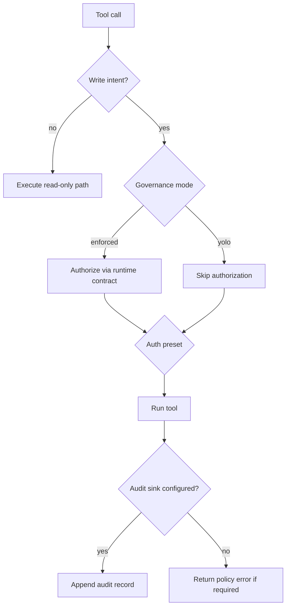
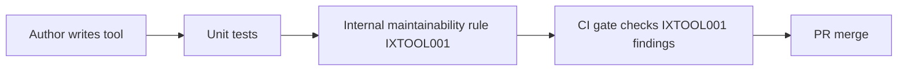

# Write Governance Playbook

This playbook defines how write-capable tools should be authored, validated, and operated across enforcement modes.

## Why this exists
- Keep write tools safe by default while still supporting `yolo` mode for controlled lab use.
- Reduce authoring drift by centralizing schema/auth/governance conventions.
- Make policy state observable and auditable at runtime.

## Authoring contract
- Write-capable tools must use one canonical schema helper:
  - `WithWriteGovernanceDefaults()`
  - `WithWriteGovernanceAndAuthenticationProbe()`
- Write intent must stay explicit (`apply`, `send`, `intent=read_write`) and non-mutating mode should remain the default when possible.
- Write contract should use `ToolWriteGovernanceConventions.*`.
- Authentication contract should use `ToolAuthenticationConventions.*`.

## Runtime modes
- `enforced`
  - Requires governance runtime (unless explicitly disabled).
  - Supports audit sink requirements (`none|file|sqlite`).
  - Honors auth runtime presets (`default|strict|lab`).
- `yolo`
  - Bypasses governance authorization checks for write-intent calls.
  - Still benefits from explicit tool contract metadata and policy visibility.

## Flow diagram

## CI enforcement layers

## Policy matrix
| Area | Enforced | Yolo |
|---|---|---|
| Write governance runtime | Required by default | Not required |
| Explicit write metadata | Required by contract | Required by contract |
| Audit sink requirement | Configurable fail-closed | Configurable fail-closed |
| Auth preset behavior | Applied | Applied |
| Tool authoring helper requirement | Required | Required |

## Operational guidance
- Use `enforced + strict` for production and shared automation paths.
- Use `enforced + default` for balanced safety with lower friction.
- Use `yolo + lab` only for isolated, temporary experimentation.
- If running `yolo`, keep audit sink enabled to retain post-action traceability.

## Quick verification checklist
- Rule catalog contains `IXTOOL001`.
- Maintainability default pack includes `IXTOOL001`.
- CI runs `analyze run` with maintainability pack and fails on `IXTOOL001` findings.
- Runtime status output surfaces active governance/auth/audit policy state.
