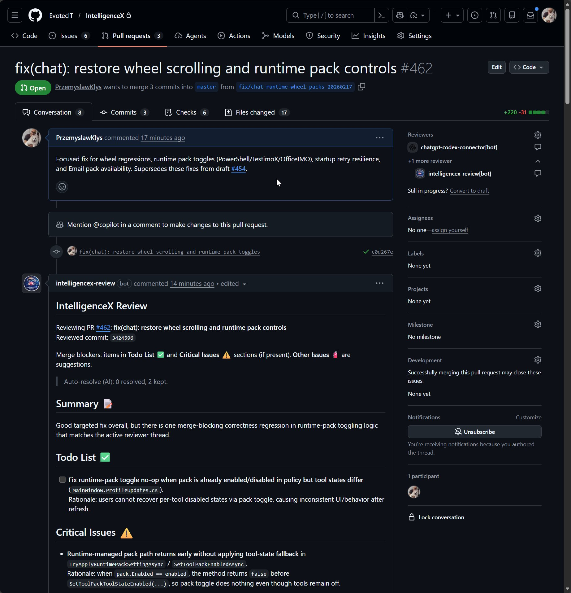
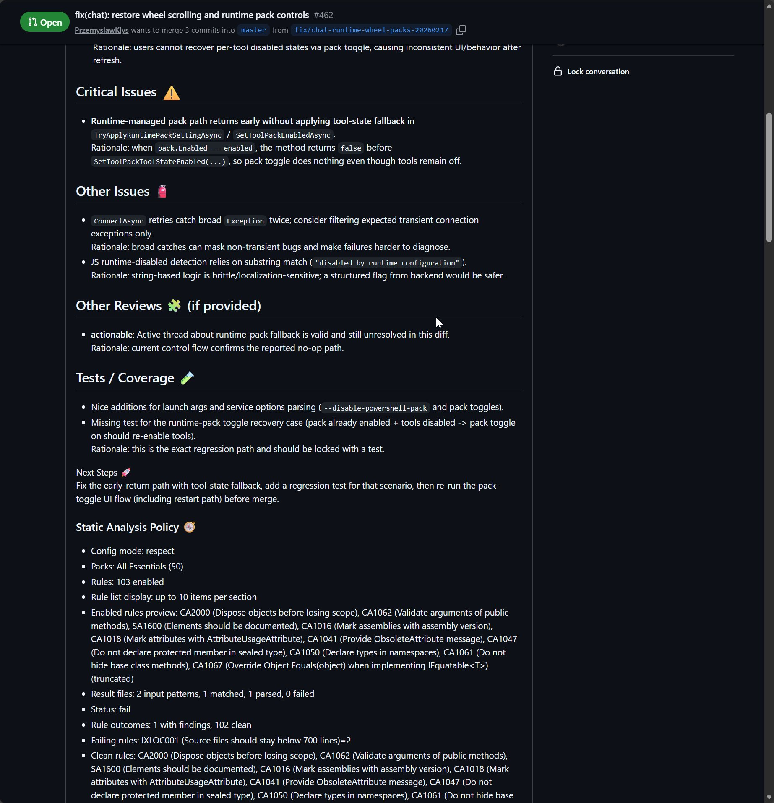
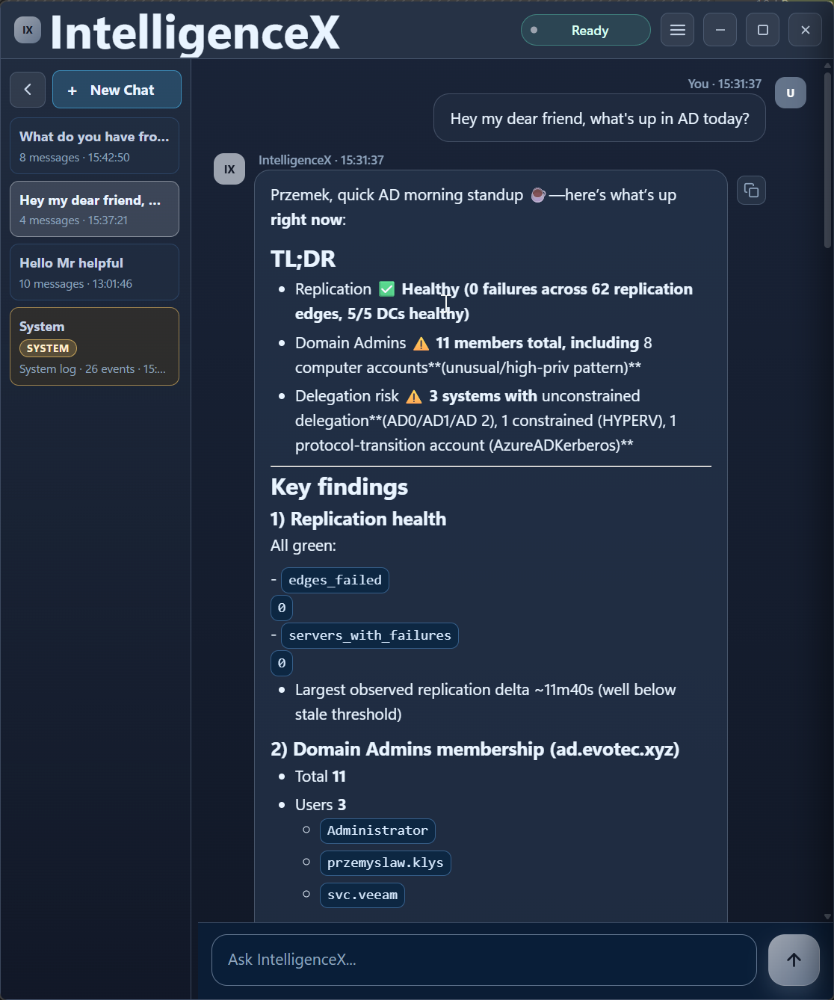
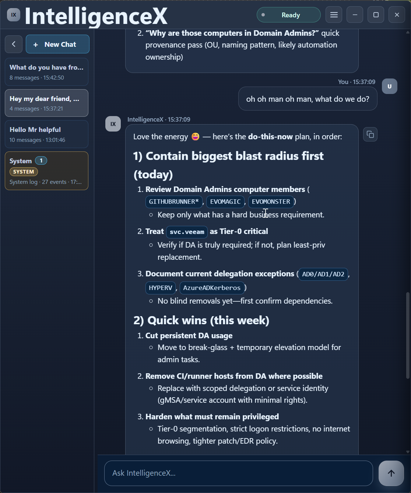
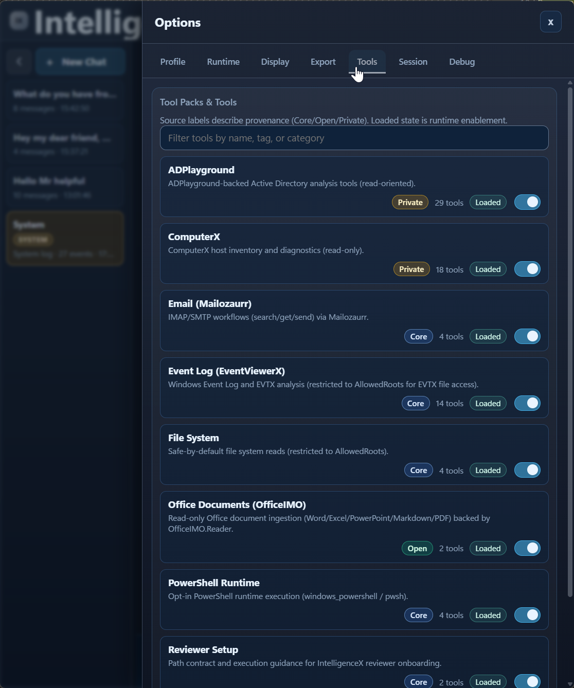
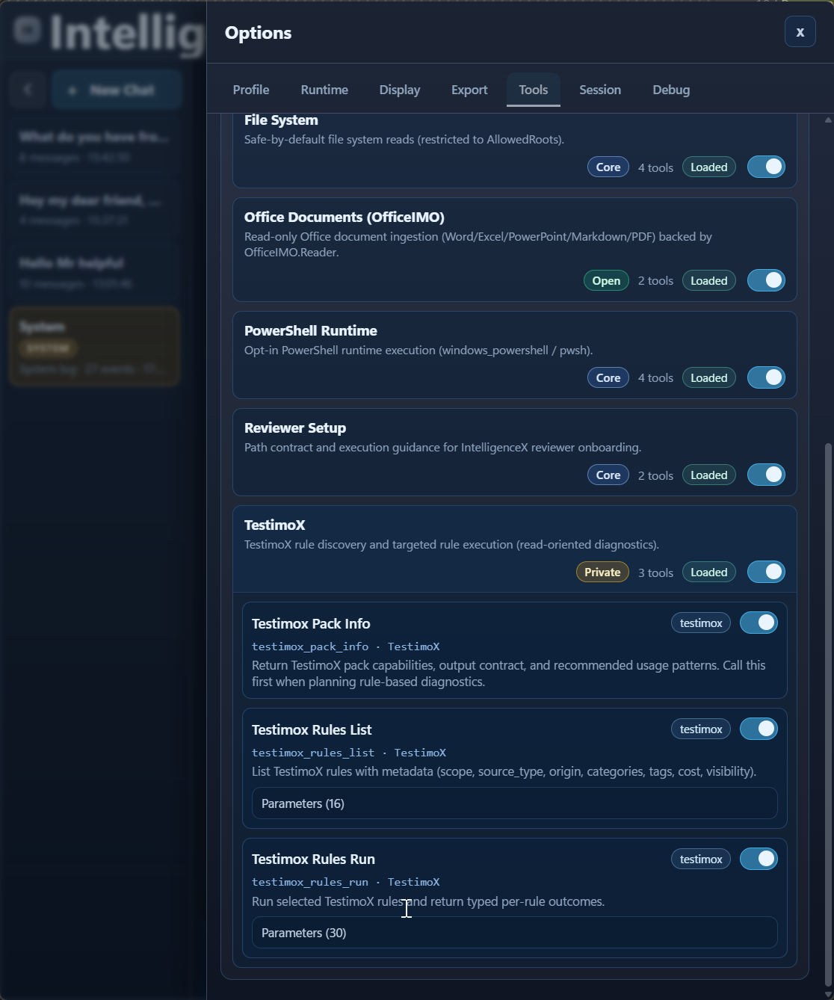
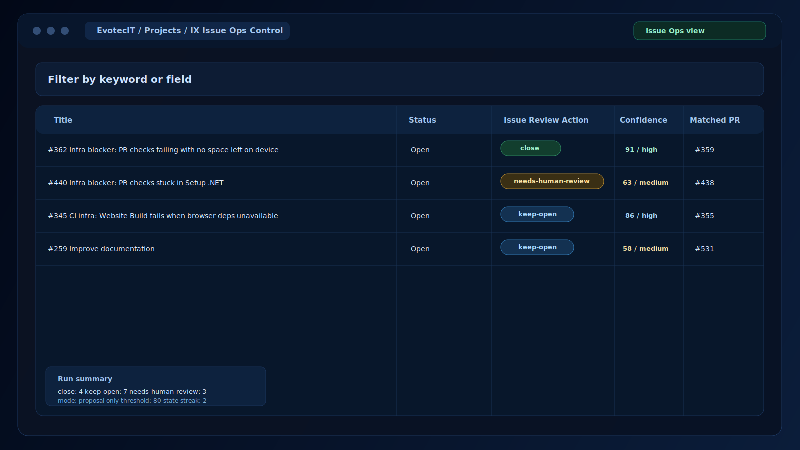
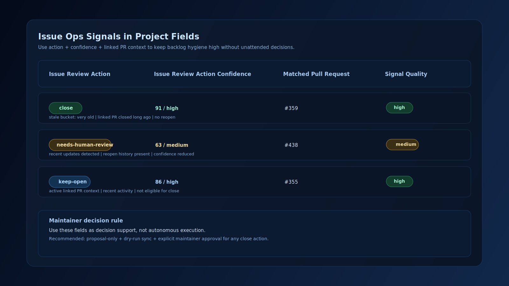
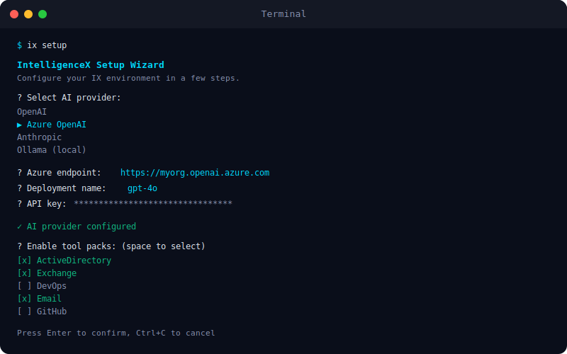
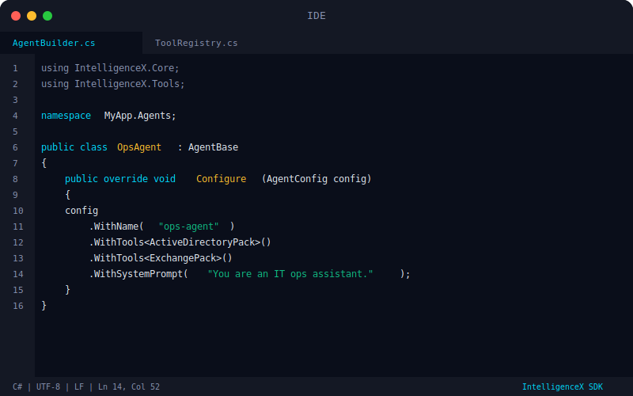

# IntelligenceX

Zero-trust AI platform with code reviews, desktop chat, tool packs, and developer libraries.  
Your credentials, your GitHub App, your control.

[](https://github.com/EvotecIT/IntelligenceX)
[](https://github.com/EvotecIT/IntelligenceX)
[](https://github.com/EvotecIT/IntelligenceX/actions/workflows/test-dotnet.yml)

## Platform Areas

- GitHub Actions Reviewer
- IX Chat (Windows desktop tray app)
- IX Tools (tool packs for chat and integrations)
- CLI tools (setup/auth/ops workflows)
- .NET library
- PowerShell module
- Issue Ops + Project Control

## Product Walkthrough

Screenshots below are sourced from current blog/gallery assets and mirrored under `Assets/README/` for stable GitHub rendering.

### GitHub Actions Reviewer

AI PR reviewer for actionable findings, merge-blocking triage, and cleaner review loops.

- Docs: `Docs/reviewer/overview.md`
- Blog: `Website/content/blog/ix-reviewer-in-action.md`

Picture 1:



Picture 2:



### IX Chat

Windows tray chat app with provider/runtime selection and tool-calling support for diagnostics and investigation workflows.

Warning: IX Chat is experimental and not intended for production operations. Use in dev/test environments only with human review in the loop.

- Docs: `Docs/chat/overview.md`
- Blog: `Website/content/blog/chat-flow-and-options.md`
- Blog: `Website/content/blog/multilanguage-support-in-action.md`

Picture 1:



Picture 2:



### IX Tools

Tool packs for event/AD/system workflows used by IX Chat and custom integrations.

- Docs: `Docs/tools/overview.md`
- Docs: `Docs/library/tool-packs.md`
- Blog: `Website/content/blog/event-viewer-in-action.md`

Picture 1:



Picture 2:



### Issue Ops + Project Control

Project board and issue triage workflows for handling blockers, confidence signals, and follow-up actions.

- Docs: `Docs/project-ops/overview.md`
- Docs: `Docs/reviewer/projects-pr-monitoring.md`
- Blog: `Website/content/blog/ix-issue-ops-in-action.md`

Picture 1:



Picture 2:



### CLI + .NET + PowerShell

Developer-facing interfaces for setup automation, embedding IntelligenceX in .NET apps, and scripting in PowerShell.

- Docs: `Docs/cli/overview.md`
- Docs: `Docs/library/overview.md`
- Docs: `Docs/powershell/overview.md`
- Blog: `Website/content/blog/setup-best-practices-for-teams.md`

Picture 1:



Picture 2:



## Quick Start

Recommended onboarding:

```powershell
intelligencex setup wizard
```

Local web setup flow:

```powershell
intelligencex setup web
```

From source:

```powershell
dotnet run --project IntelligenceX.Cli/IntelligenceX.Cli.csproj -c Release -- setup wizard
```

## Trust Model

- No backend service: IntelligenceX runs locally and/or in your GitHub Actions.
- Secrets stay under your control: stored in the environments you own.
- Bring your own GitHub App for identity, permissions, and auditability.
- Workflow changes happen via PRs so setup changes stay reviewable.

## Documentation

- Start here: `Docs/getting-started.md`
- Reviewer: `Docs/reviewer/overview.md`
- IX Chat: `Docs/chat/overview.md`
- Tools: `Docs/tools/overview.md`
- CLI: `Docs/cli/overview.md`
- .NET library: `Docs/library/overview.md`
- PowerShell: `Docs/powershell/overview.md`
- Project Ops: `Docs/project-ops/overview.md`
- Security: `Docs/security.md`

## Repository Layout

- `IntelligenceX/`: core library
- `IntelligenceX.Reviewer/`: review pipeline executable
- `IntelligenceX.Cli/`: setup/auth/ops commands
- `IntelligenceX.Chat/`: desktop chat app, host, service, client
- `IntelligenceX.Tools/`: in-repo tool packs and contracts
- `Docs/`: source docs (published to the website)

## Build

Core CI-equivalent build check:

```powershell
dotnet build IntelligenceX.CI.slnf -c Release
dotnet test IntelligenceX.CI.slnf -c Release

# CI also runs the executable test harness:
dotnet ./IntelligenceX.Tests/bin/Release/net8.0/IntelligenceX.Tests.dll
dotnet ./IntelligenceX.Tests/bin/Release/net10.0/IntelligenceX.Tests.dll
```

`IntelligenceX.sln` includes Chat/Tools projects for local integration work.

Publish CLI (self-contained single-file):

```powershell
pwsh ./Build/Publish-Cli.ps1 -Runtime win-x64 -Configuration Release -Framework net8.0
```

## License

MIT
